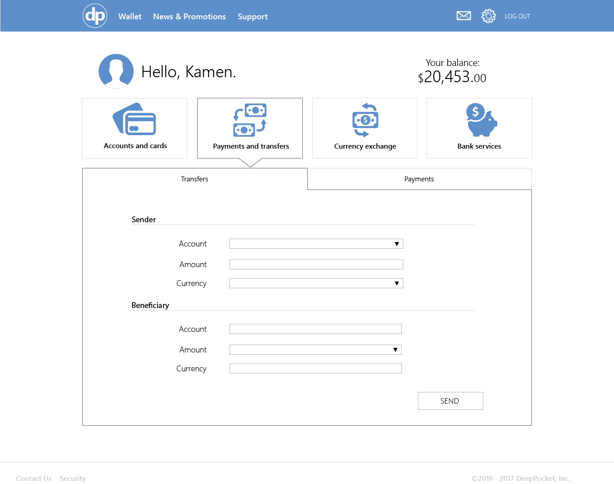

# dais-bank-UI
### Sample UI for a personal bank account

### [live demo](https://deeppockets-70a3b.firebaseapp.com/)

### Hot to run:

* npm install
* gulp dev
* or use the live demo

### Userflow

---

### Wireframes

* Accounts and cards info
---

*  Transactions info
---

*  Transfer form
---

